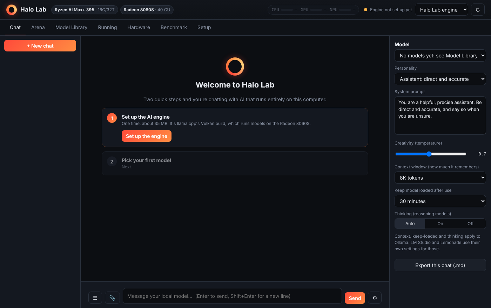
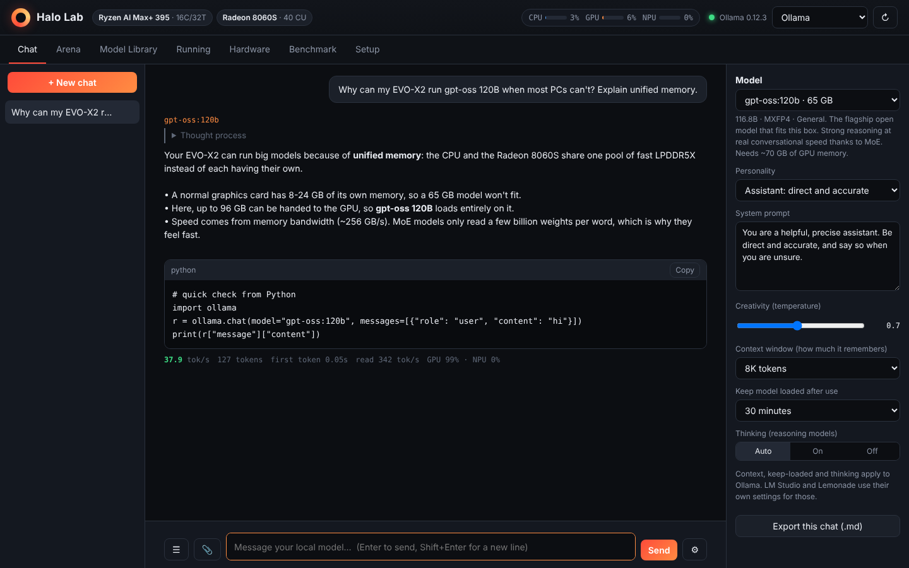
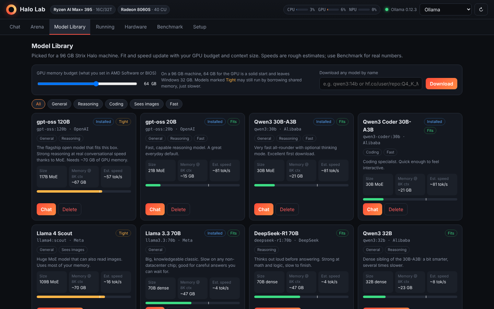
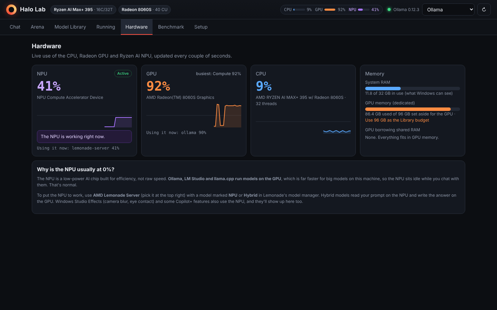
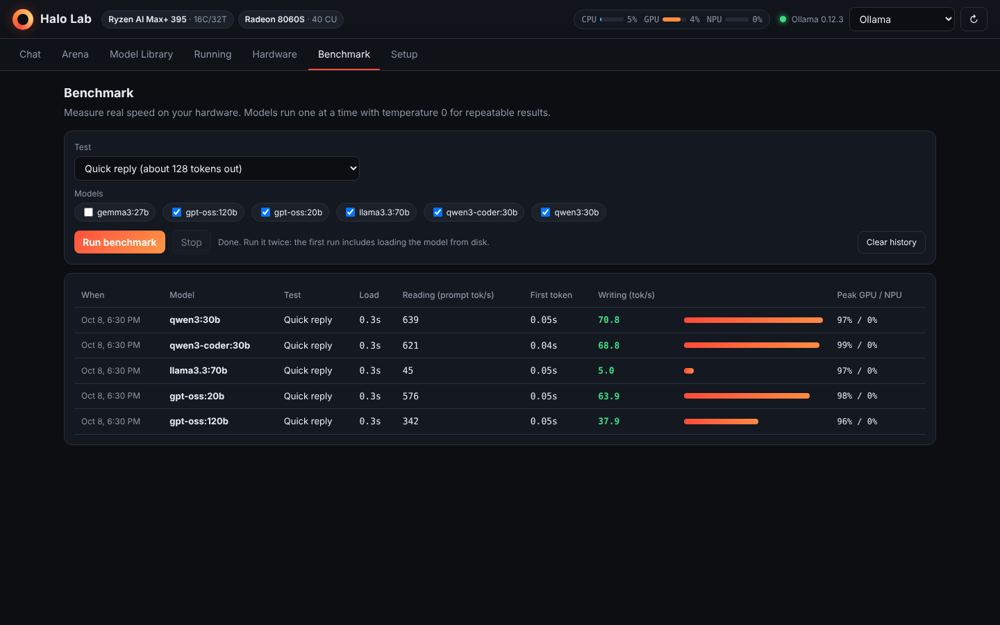
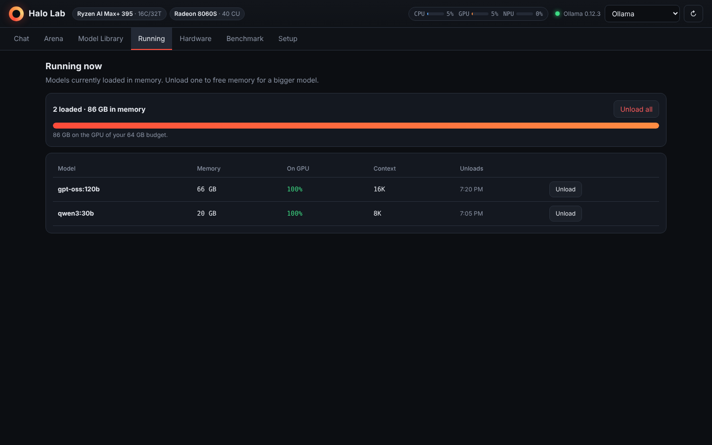

# Halo Lab

A local AI dashboard for AMD **Ryzen AI Max+ 395** ("Strix Halo") mini PCs such as the
GMKtec EVO-X2. These machines share up to 96 GB of fast memory with the Radeon 8060S GPU,
so they can run models no ordinary graphics card can hold, such as gpt-oss 120B and
Llama 4 Scout. Halo Lab gives you one place to download, chat with, compare and benchmark
those models, and to see what the CPU, GPU and NPU are actually doing.

It works on its own, like The Shelf's AI tab: double-click the desktop icon, press **Set up the engine**
once, pick a model, and chat. Halo Lab installs and runs its own engine (llama.cpp's Vulkan build,
which uses the Radeon GPU), downloads models from Hugging Face and loads them for you.

Everything runs on your own computer. Nothing you type leaves it.

## What's inside

- **Chat**: streaming answers with live tokens per second, saved chats, image input for vision
  models, a collapsible "thought process" for reasoning models, personality presets, and
  controls for temperature, context window (up to 128K) and how long a model stays loaded.
  Every answer also records peak GPU and NPU use.
- **Model Library**: 15 models picked for a 96 GB Strix Halo machine, from a 3B test model up to
  gpt-oss 120B. Each card says whether it fits your GPU memory setting at your context size,
  with an estimated speed and one-click download or delete. Any other Ollama or Hugging Face
  model can be downloaded by name.
- **Arena**: ask 2–4 models the same question side by side and see which is fastest.
- **Running**: what's loaded, a progress bar while a model loads, and Unload buttons to free memory.
- **Memory**: MEM and VRAM gauges in the header with a **Clear memory** button (unloads the model and
  frees RAM other programs aren't using), and a list of apps holding GPU memory with Close buttons for
  other AI apps such as LM Studio and Ollama. Before loading, Halo Lab checks how much GPU memory is
  really free and, if a model doesn't fully fit, runs part of it on the CPU instead of failing.
- **Hardware**: live CPU, GPU and **NPU** use with graphs, which programs are using the GPU and
  NPU, GPU memory in use, and whether a model has spilled into slower shared RAM.
- **Benchmark**: real reading and writing speeds on your machine, with peak GPU/NPU use and history.
- **Setup**: the models folder (put big models on a roomy drive), engine updates, and optional
  other engines: Ollama, LM Studio and AMD Lemonade Server.

## Getting started (Windows)

1. The first time, double-click **Start Halo Lab.bat** (it also puts a **Halo Lab** icon on your
   Desktop; use that from then on). Halo Lab starts in the background, shows an orange ring near
   the clock, and opens in your browser.
2. Press **Set up the engine**. It's a one-time download of about 35 MB.
3. Pick your first model. Qwen3 30B-A3B is the recommended start: smart and very fast on this chip.
4. Chat. The model loads into GPU memory by itself the first time you use it.

The engine uses the GPU's set-aside memory plus shared memory, so a 96 GB EVO-X2 can give it
about 76–80 GB with default settings. That's enough for every model in the Library, including
gpt-oss 120B. Halo Lab reads the real amount from your PC.

To quit, right-click the orange ring and choose **Quit Halo Lab**.

## Files

| File | What it is |
| --- | --- |
| `Halo Lab.html` | The dashboard. `index.html` is the same file. |
| `halo-server.ps1` | The background program. It serves the dashboard at `http://localhost:11500`, reads the CPU/GPU/NPU counters Task Manager uses, installs the engine, downloads models and starts or stops the engine. It listens only on this computer unless you turn on home-network access in Setup, and it needs nothing installed (it uses the PowerShell built into Windows). |
| `halo-relay.js` | The optional home-network relay (Node.js). Halo Lab starts and stops it by itself. |
| `halo-start.ps1` | The launcher the desktop icon runs. It keeps the icon pointing at this folder and, if Halo Lab can't start, shows a message and writes `startup.log`. |
| `Start Halo Lab.bat` | Starts Halo Lab, the same as the desktop icon. |
| `Fix Ollama connection.bat` | Only needed if you choose Ollama as the engine. |

Halo Lab keeps the engine and models in `%LOCALAPPDATA%\HaloLab` unless you choose another models
folder in Setup. The engine runs at `http://127.0.0.1:11600`, so other programs on this computer
can use the loaded model through its OpenAI-compatible API.

## Opening Halo Lab from other devices

Setup → **Network access** lets you change the port (11500 by default) and turn on
**Let other devices on my home network open Halo Lab**. If Node.js is installed, Halo Lab starts a small
relay (`halo-relay.js`) on the next port up (11501 by default). Windows normally already lets Node.js
through its firewall, so no admin permission is needed. Without Node.js, Windows asks for permission once
and Halo Lab shares its own port, letting in only devices on your local network.
Setup shows the address to type on a phone, tablet or Raspberry Pi (for example
`http://192.168.1.50:11501/`). Halo Lab has no login, so anyone on your Wi-Fi can open it. From other devices you can chat, compare models and watch the meters;
closing apps, deleting models and changing settings only work on the Halo Lab PC itself.

## About the NPU

Model Library → **Runs on the NPU** has one-click buttons: **Install FastFlowLM** (AMD's free NPU runtime, one time)
and **Run on NPU** on each model, which downloads it, starts it on the NPU and switches Chat to it. On an EVO-X2,
Qwen3 1.7B ran at 41.6 tok/s on the NPU.

The NPU reading 0% while you chat is normal. Ollama, LM Studio and llama.cpp run models on
the GPU, which is much faster than the NPU for large models. To use the NPU, run AMD Lemonade
Server with a model marked NPU or Hybrid and pick Lemonade at the top right. NPU activity
shows up only on Windows 11 24H2 or newer with AMD's NPU driver installed. If Task Manager
shows an NPU graph, Halo Lab will too.

## Notes

- Screenshots use demo data. On a real EVO-X2 (96 GB), Llama 3.2 3B ran at about 90 tok/s writing and
  1,300 tok/s reading with the GPU at 96%, and the engine could use about 80 GB of GPU memory.
- Download sizes in the Library are the real Hugging Face file sizes. Speeds are estimates; use the
  Benchmark tab for real numbers.
- The model list reflects what was current in mid-2026. Newer models can be downloaded by name.
- Chats and settings are saved in your browser only.
